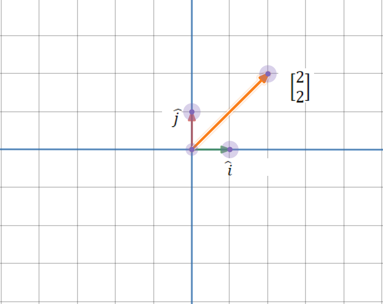
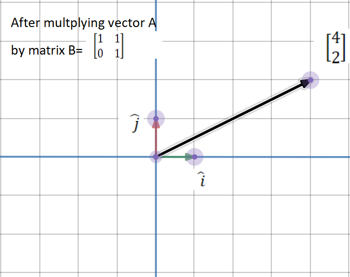
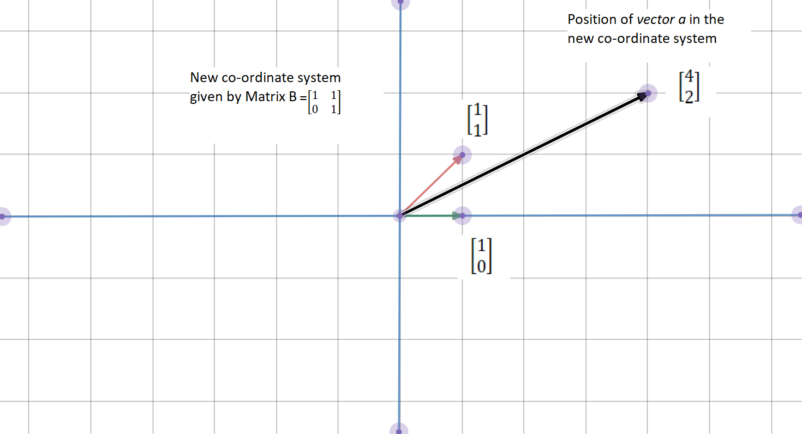
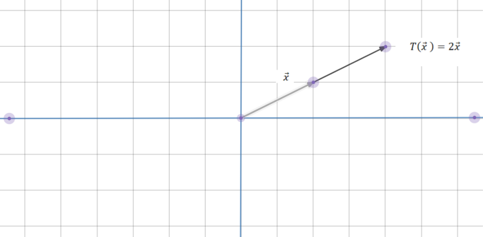

## What is PCA?

Principal components analysis (PCA) is a technique for reducing the dimensionality of such datasets, increasing interpretability but at the same time minimizing information loss.

PCA is an:
- **Unsupervised approach**: because it involves only a set of features or variables $X_1, X_2, ... , X_p$ and **no** associated response $Y$
- **Feature extraction method**: because a new independent variable is extracted as combination of the variables in the dataset.

It finds a low-dimensional representation of a data set that contains as much as possible of the variation. The idea is that each of the $n$ observations lives in $p-$dimensional space, but not all of these dimensions are equally interesting. PCA seeks a small number of dimensions that are as interesting as possible, where the concept of interesting is measured by the amount that the observations vary along each dimension.

The first principal component of a set of features $X_1, X_2, ... , X_p$ is the *normalized* linear combination of the features that has the largest variance.

$$
Z_{1}=\phi_{11} X_{1}+\phi_{21} X_{2}+\cdots+\phi_{p 1} X_{p}
$$

By normalized, we mean that $\sum_{j=1}^p \phi^2_{j1} =1$. We refer to the elements $\phi_{11}, ..., \phi_{p1}$ as the **loadings** of the first principal component. Together, the loadings make up the principal component loading vector, $\bf{\phi} =(\phi_{11}, ..., \phi_{p1})^T$ We constrain the loadings so that their sum of squares is equal to one, since otherwise setting these elements to be arbitrarily large in absolute value could result in an arbitrarily large variance.

Given a $(n,p)$ data set $X$ how do we compute the first principal component? Since we are only interested in variance, we assume that each of the variables in $X$ has been centered to have mean zero (that is, the column means of X are zero). We then look for the linear combination of the sample feature values of the form:

$$
z_{i1}=\phi_{11} x_{i1}+\phi_{21} x_{i2}+\cdots+\phi_{p 1} x_{ip}
$$
 That has largest sample variance, subject to the constraint that $\sum_{j=1}^{p} \phi_{j 1}^{2}=1$. In other words, the first principal component loading vector solves the optimization problem:

$$
\underset{\phi_{11}, \ldots, \phi_{p 1}}{\operatorname{maximize}}\left\{\frac{1}{n} \sum_{i=1}^{n}\left(\sum_{j=1}^{p} \phi_{j 1} x_{i j}\right)^{2}\right\} \text { subject to } \sum_{j=1}^{p} \phi_{j 1}^{2}=1
$$

We can rewrite the linear combination of the sample feature values function as $\frac{1}{n}\sum_{i=1}^n z_{i1}^2$ Since $\frac{1}{n}\sum_{i=1}^n x_{ij}= 0$, the average of the $z_{11}, ... , z_{n1}$ will be zero as well. The problem can be solved via an eigendecomposition.

### Steps to perform PCA
1. Take your matrix of independent variables or features $X$, whose columns are $X_1, X_2, ... , X_p$ and standarize each column or variable. Therefore we would obtain a new centered matrix $Z$. Centered would mean that each column has mean zero.

$$
\quad Z_1 = \frac{X_1-\mu_1}{\sigma_1}
$$

1. Take the matrix $Z$ transpose it and multiply the transposed matrix by $Z$. This would yield a covariance matrix of $Z$.

$$
Z^TZ
$$

2. Calculate the eigenvectors and their corresponding eigenvalues of $Z^TZ$. This process is the eigendecomposition of $Z^TZ$ into $PDP^{-1}$ where $P$ is the matrix of eigenvectors and $D$ is the is the *diagonal matrix* with **eigenvalues** on the diagonal and values of zero everywhere else.
The eigenvalues on the diagonal of $D$ will be associated with the corresponding column in $P$.
That is, the first element of $D$ is $\lambda_1$ and the corresponding eigenvector is the first column of $P$.
This holds for all elements in $D$ and their corresponding eigenvectors in $P$.. We will always be able to calculate $PDP^{-1}$ in this fashion.
**Good news**: we can always calculate $PDP^{-1}$ in this fashion because $Z^TZ$ is a symmetric, positive semidefinite matrix.
3. Take the eigenvalues $\lambda_1,\lambda_2, ..., \lambda_p$ and sort them from largest to smallest. In doing so, sort the eigenvectors in $P$. accordingly. (For example, if $\lambda_2$ is the largest eigenvalue, then take the second column of $P$ and place it in the first column position.) Call this sorted matrix of eigenvectors $P^*$. The columns of $P^*$ should be the same as the columns of $P$ but perhaps in a different order.)
**Good news:** these eigenvectors are independent of one another.
4. Calculate $Z^* = ZP^*$. This new matrix, $Z^*$, is a centered/standardized version of $X$ but now each observation is a combination of the original variables, where the weights are determined by the eigenvector.
**Good news:** because our eigenvectors in *P** are independent of one another, each column of *Z** is also independent of one another. In other words they are **orthogonal** to every other PC, where orthogonal is fancy math word for perpendicular.

### In a nuthsell

PCA is a method that brings together:
1. A measure of how each variable is associated with one another. (**Covariance matrix**.)
2. The directions in which our data are dispersed. (**Eigenvectors**.)
3. The relative importance of these different directions. (**Eigenvalues**.)

PCA combines our predictors and allows us to drop the eigenvectors that are relatively unimportant. Next section would describe these three elements, if your are already familar you can skip it.

#### 1. Covariance matrix

**Variance** is a measure of the variability or it simply measures how spread the data set is. Mathematically, it is the average squared deviation from the mean score.

$$
var(x) = \frac{1}{n} \sum(x_i-\bar{x})^2
$$

**Covariance** is a measure of the extent to which corresponding elements from two sets of ordered data move in the same direction.

The variance-covariance matrix or simply covariance matrix $C_x$ is obtained

$$
C_{x}=E[(X-E[X])(X-E[X])]=\frac{1}{n-1}(X-\bar{X})(X-\bar{X})^{T}
$$

Once we have demeaned the matrix $X$ sa $Z$ we can calculate the $C_x$ matrix as the matrix premultiplication of the transpose by the matrix with out being transpose.

$$
C_x =\frac{1}{n-1} Z^TZ=\left(\begin{array}{cccc}z_{11} & z_{21} & \cdots & z_{p 1} \\z_{12} & z_{22} & \cdots & z_{p 2} \\\vdots & \vdots & \ddots & \vdots \\z_{1 n} & z_{2 n} & \cdots & z_{pn}\end{array}\right)\left(\begin{array}{cccc}z_{11} & z_{12} & \cdots & z_{1 p} \\z_{21} & z_{22} & \cdots & z_{2 p} \\\vdots & \vdots & \ddots & \vdots \\z_{n 1} & z_{n 2} & \cdots & z_{n p}\end{array}\right) =\\=\begin{bmatrix} 
\sum_iz_{i1}^2 & \cdots& \sum_iz_{i1}z_{ip} \\
\sum_iz_{ni}z_{i1} & \cdots&  \sum_iz_{in}^2 
\end{bmatrix}= \begin{bmatrix} 
Var(Z_1)& \cdots& Cov(Z_{1,p}) \\
Cov(Z_{n,1}) & \cdots&  Var(Z_n) 
\end{bmatrix}
$$

#### 2. Eigenvectors

Eigenvectors are those vectors when a linear transformation is performed on them, then **their directions does not change**.

Matrices are said to act as functions or ‘transformations’ in the linear space- which means, after applying a transformation to a vector in the linear space, the *linearity* is maintained.

Imagine the vector $a=\begin{bmatrix} 2\\2\end{bmatrix}$ we can represent it in a coordinate space.

Now imagine the matrix $B=\begin{bmatrix} 1&1\\0&1\end{bmatrix}$.If we multiply the matrix and the vector $Ba$ we obtain:

$$
Ba = \begin{bmatrix} 1&1\\0&1\end{bmatrix} \begin{bmatrix} 2\\2\end{bmatrix} = \begin{bmatrix} 4\\2\end{bmatrix}
$$

However this matrix multiplication is a changing in basis. In the standard coordinate system, unit vectors *i* and *j* are considered the ‘**basis**’ vectors. These standard basis vectors become a way of measuring our system.

The column vectors of the matrix $B$ give the position of the new basis vectors. So the vector $a$ =[4,2] ]in the new coordinate system is actually the vector [4,2]

During a linear transformation, there may exist some vectors that remain on their original span, and are only scaled or shrunk. In other words, **their direction remains *unchanged*.** Mathematically, igiven a transformation defined by the matrix $A$ it is expressed as 
$$
Av=\lambda v
$$
 Where $\lambda$ is the eigenvalue associated to the eigenvector $v$ and the matrix A is known as the transformation applied on vector $v$. In other words, we can explain teh eigenvector expressed as the Transofmration function:

$$
T(v) = \lambda v
$$

Geometrically speaking, we can visualize it in the following way

Here, the transformation on vector *x* stretches it to twice its length. Hence the eigenvalue associated with this transformation is 2. Negative eigenvalues are associated with *flipping* the vector or reversing the direction of the vector.

The eigenvector associated to this matrix are $\begin{bmatrix} 1\\0\end{bmatrix}$ and $\begin{bmatrix} -1\\0\end{bmatrix}$ which are the spaces that do not change after applying the transformation. The corresponding **eigenvalue**, is the factor by which the eigenvector is scaled.

#### 3. Eigenvalues

Consider the following matrix and vector:

$$
A=\begin{bmatrix} 7&-5\\4&-2\end{bmatrix}
$$

$$
v= \begin{bmatrix} 1\\1\end{bmatrix}
$$

Then:

$$
Av = \begin{bmatrix} 2\\2\end{bmatrix}
$$

This result can be expressed as: $2\begin{bmatrix} 1\\1\end{bmatrix}$ or $2v$

Which is actually:

$$
Av=\lambda v
$$

Where [1,1] is the Eigenvector and $\lambda=2$ is the eigenvalue.

This process can be made simplier as:

$$
Av=\lambda v\\
\rightarrow Av-\lambda v=0
\\
\rightarrow v(A-\lambda I )=0
$$

Therefore we need to find:

$$
det(A-\lambda I)=0
$$

In our example, adding the values to the matrix A we see:

$$
det(\begin{bmatrix} 7&-5\\4&-2\end{bmatrix}-\lambda\begin{bmatrix} 1&0\\0&1\end{bmatrix})=0
$$

$$
det(\begin{bmatrix} 7-\lambda&-5\\4&-2-\lambda\end{bmatrix}) = 0
$$

$$
(7-\lambda)(-2-\lambda)-(-5)(4)=0\\
-14+2\lambda-7\lambda+\lambda^2+20=0\\
-5\lambda+\lambda+6=0\\
(\lambda-2)(\lambda-3)=0
$$

And therefore our solutions are $\lambda=2$ and $\lambda=3$

The eigenvector for the first eigenvalue can be calculated as:

$$
\begin{bmatrix} 7&-5\\4&-2\end{bmatrix}\begin{bmatrix} v_1\\v_2\end{bmatrix}= 2 \begin{bmatrix} v_1\\v_2\end{bmatrix}
$$

Which becomes:

$$
7v_1-5v_2=2v_1\\
4v_1-2v_2=2v_2
$$

And this becomes:

$$
-5v_2 =-5v_1\\
4v_1= 4v_2
$$

So $v_1 =1$ and $v_2 =1$
